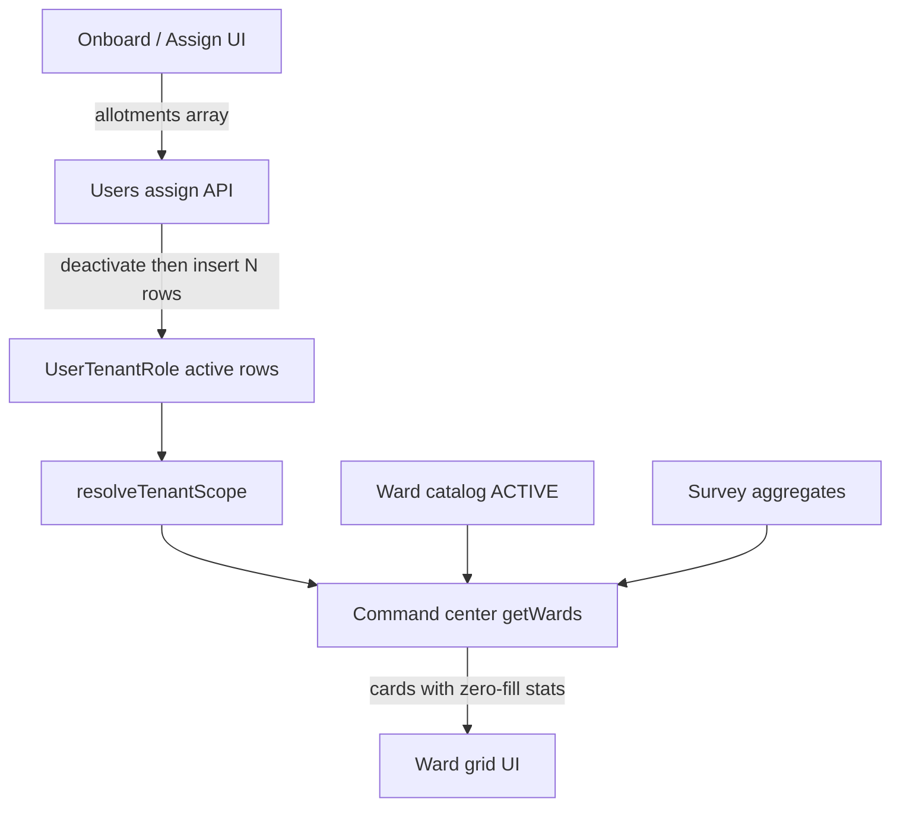

# Multi-Ward Allotments & Command Center Ward Catalog

**Date:** 2026-07-30  
**Status:** Pending user review  
**App:** `api-survey-apps` (Nest + Prisma)  
**Approach:** Multiple active `UserTenantRole` rows (same role, different geo)

## Problem

1. **Command center** ward grid only lists wards that already have surveys. Master-data wards with zero surveys never appear after selecting a ULB.
2. **User onboard / role assign** uses a single State → District → ULB → Ward assignment. Field roles cannot hold multiple ULB + ward pairs at once.
3. **QC Supervisor** can be saved without geography today, while Surveyor / Field Supervisor require full geo including ward. Product now needs ward on every allotment for all three field roles.

## Goals

- Show **all ACTIVE wards** for the selected ULB on the command center, with survey stats left-joined (zeros when none).
- Allow **SURVEYOR**, **FIELD_SUPERVISOR**, and **QC_SUPERVISOR** to hold **multiple simultaneous ULB + ward pairs**.
- Require **State + District + ULB + Ward** on every allotment for those three roles at onboard and assign time.
- Reuse existing `resolveTenantScope` / `buildTenantWhere` (already unions active rows).

## Non-goals

- New `UserAllotment` table or JSON geography on `User`.
- Multi-allotment for Admin or department roles (unchanged single / no-geo behavior).
- Changing Convex / `sdv-monorepo-apps`.
- Redesigning command-center card chrome beyond label fix and empty-ward inclusion.
- Lazy pagination of ward cards in this pass (catalog sizes are expected to stay modest per ULB).

## Architecture



## Data model

No Prisma schema change. Continue using `UserTenantRole`:

| Field                                      | Multi-allotment use                                                   |
| ------------------------------------------ | --------------------------------------------------------------------- |
| `userId`, `roleId`                         | Same user + same field role on every active row                       |
| `stateId`, `districtId`, `ulbId`, `wardId` | Full geo per row; all four required for field roles                   |
| `isActive`                                 | Multiple `true` rows allowed for field roles                          |
| History                                    | Prior rows deactivated on replace (`deactivatedAt` / `deactivatedBy`) |

**Uniqueness on save:** no duplicate `wardId` in one allotment set. Each ward must belong to its row’s `ulbId`.

## API

### Assign / onboard

Extend assign (and onboard path that creates the first assignment) to accept:

```ts
allotments: Array<{
  stateId: string
  districtId: string
  ulbId: string
  wardId: string
}>
```

**Field roles** (`SURVEYOR`, `FIELD_SUPERVISOR`, `QC_SUPERVISOR`):

- `allotments.length >= 1`
- Every item requires all four geo IDs
- Validate ward ∈ ULB, ULB ∈ district, district ∈ state
- Apply existing grant-ceiling checks **per allotment**
- Transaction: deactivate all currently active roles for the user, then insert one `UserTenantRole` per allotment (same `roleId`)

**Backward compatibility:** if client still sends a single flat `stateId`/`districtId`/`ulbId`/`wardId`, treat it as a one-element `allotments` array.

**Other roles:** keep current single-assignment (or no-geo) rules; do not require `allotments[]`.

### Command center `GET …/wards`

When `ulbId` is set:

1. Load ACTIVE wards for that ULB (ordered by `wardNumber`).
2. Filter by caller tenant scope (ward-scoped users only see their wards; broader scopes see all ULB wards they can access).
3. Aggregate survey counts by `wardId` with existing filters (status, QC, date).
4. Left-join: every catalog ward returned; missing aggregate → zeros / `activeSurveyors: 0`.
5. Ward label: prefer trimmed `wardName`; fallback `Ward {wardNumber}`. Do **not** rewrite names that do not start with `"Ward"`.

When `ulbId` is missing: return `[]` (UI empty state unchanged).

## UI

### Onboard wizard & assign-role dialog

For the three field roles:

- Replace single cascade with an **allotments list**.
- Each row: State → District → ULB → Ward + remove.
- **Add allotment** appends a row.
- Cannot advance / finish with zero rows or any row missing ward.
- Confirm step lists every pair with resolved names.

Other roles: existing geography (or none).

### Users list / profile

- Show multiple ward chips (e.g. first 3 + `+N`).
- Drawer / tooltip lists full allotment set.

### Command center grid

- No structural redesign; receives zero-filled ward cards so empty wards appear.
- Empty only when no ULB selected or ULB has no ACTIVE wards in catalog (after scope filter).

## Error handling

| Case                                       | Response                           |
| ------------------------------------------ | ---------------------------------- |
| Field role with empty allotments           | `400`                              |
| Missing geo field on a row                 | `400`                              |
| Ward not under ULB (or hierarchy mismatch) | `400`                              |
| Duplicate `wardId` in payload              | `400`                              |
| Allotment outside actor grant ceiling      | `403` / existing forbidden pattern |

## Edge cases

- **Replace set:** full replace of active rows in one transaction (not patch-merge of individual wards).
- **Role change** to Admin / dept: deactivate all field allotments; apply that role’s rules.
- **QC Supervisor:** requires full geo including ward (same as Surveyor / Field Supervisor).
- **Filtered command center:** catalog wards still listed; stats respect filters (may all be zero).

## Testing

- Assign two ULB+ward pairs; `resolveTenantScope.wardIds` contains both; surveys outside those wards denied.
- Onboard / assign UI blocks finish without ward; add/remove rows; confirm shows names.
- Command center for a ULB with N master wards and surveys in only M wards returns N cards (N−M zeros).
- Admin / dept single-assignment regression.
- Grant ceiling rejects an allotment outside actor scope while allowing valid peers in the same request only if the whole set is valid (reject entire request if any row fails).

## Out of scope follow-ups

- Per-ULB “all wards” shortcut (empty ward = whole ULB) — not in this design; ward always required for field roles.
- Infinite-scroll ward grid for very large ULBs.
